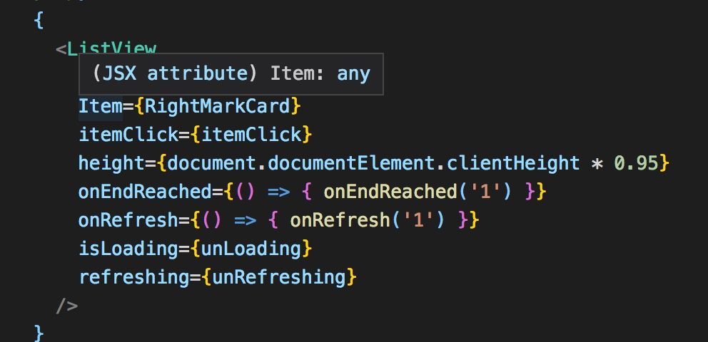

# LiewView 使用指南

## 入参

一共需要传递 8 个参数

- data: 列表里的数据，以数组的形式传递，组件中传递的每一项的数据也要改成 `data`
- Item: 这里传递的是组件，即将一整个组件放进去即可
- itemClick: 每一项的点击事件，然后你组件内部的点击事件也要改成 `itemClick`, 如果有不懂，直接参考该组件 `54` 行代码
- height: 该 `ListView` 的高度
- onEndReached: 上拉触底加载事件
- isLoading: 是否展示上拉触底加载的圈圈效果
- refreshing: 是否展示下拉刷新的圈圈效果
- onRefresh: 下拉刷新事件



## 注意事项

当使用该组件会出现页面滑动双层的问题。

因为不同的组件所要的效果不同，请在组件外部局部改变底层样式，比如：

```css
.listDiv {
  :global {
    .am-list-body {
      background-color: rgb(245, 245, 249);
    }
    .am-list-view-scrollview {
      height: 98% !important;
      padding-top: 80px;
    }
  }
}
```

上面只是个例子，还请根据实际情况进行操作。
